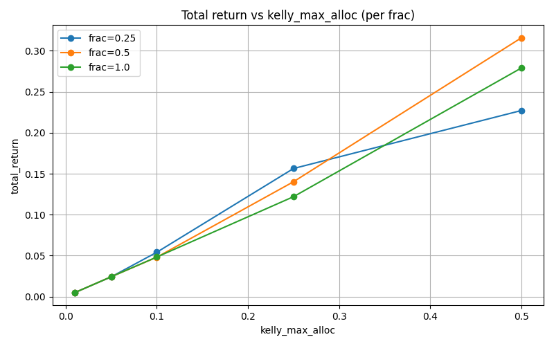
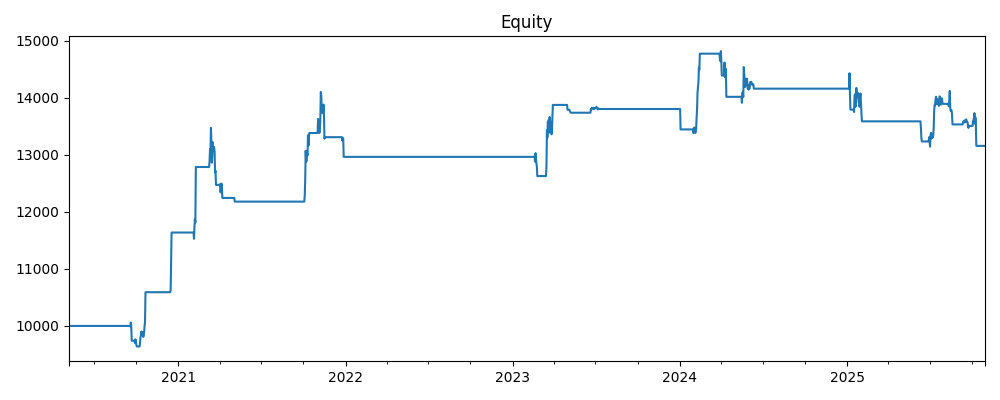
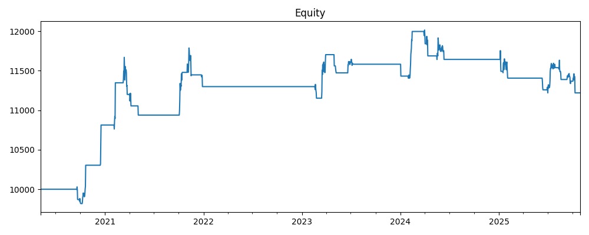

# ma_crossover — Kelly 网格敏感性分析报告

此文档基于已运行的网格实验（见 `results/s3/ma_crossover_compare/grid/summary.csv`），研究了不同 fractional Kelly（frac）与 kelly_max_alloc 对策略（`ma_crossover`）回测表现的影响，并给出推荐配置与复现实验命令。

## 关键输出（位置）

- 网格汇总 CSV：results/s3/ma_crossover_compare/grid/summary.csv
- 对比图（Total return vs kelly_max_alloc）：results/s3/ma_crossover_compare/grid/return_vs_alloc.png
- 各格点回测子目录：results/s3/ma_crossover_compare/grid/run_XX_f{frac}_max{max_alloc}/（每个子目录包含 equity.csv、metrics.json、trades.csv）



## 示例净值曲线（代表性格点）

下面是几个在网格中具有代表性的格点的净值曲线示例（图片已复制到 `docs/`）：

### 稳健配置 — run_04 (frac=0.25, max_alloc=0.25)


### 激进配置 — run_10 (frac=0.5, max_alloc=0.5)


### 中性配置 — run_14 (frac=1.0, max_alloc=0.25)


### 极保守配置 — run_01 (frac=0.25, max_alloc=0.01)


下面是从 summary.csv 提取的关键行（网格共 15 个格点）：

| run | frac | kelly_max_alloc | total_return | annualized_return | max_drawdown | volatility | sharpe | final_equity |
|-----|------|-----------------|--------------:|------------------:|-------------:|-----------:|-------:|-------------:|
| 4   | 0.25 | 0.25            | 0.15634      | 0.02685           | -0.05783     | 0.03919    | 0.4862 | 11563.41     |
|10   | 0.5  | 0.5             | 0.31580      | 0.05133           | -0.11307     | 0.07757    | 0.4838 | 13157.96     |
|14   | 1.0  | 0.25            | 0.12192      | 0.02121           | -0.06621     | 0.04055    | 0.3775 | 11219.21     |
| 1   | 0.25 | 0.01            | 0.00486      | 0.00088           | -0.00272     | 0.00166    | 0.3682 | 10048.58     |

> 注：表中仅列出若干具有代表性的格点以供快速参考；完整数据请查看 `summary.csv`。

## 解读要点（简短）

- 风险/收益权衡明显：提高 `kelly_max_alloc` 或增加 `frac` 会提升绝对收益（total_return），但同时增加最大回撤与波动率。
- 平衡点示例：`frac=0.25, kelly_max_alloc=0.25`（run 4）在此实验中给出了较高的 Sharpe（≈0.486）与较低的回撤（≈5.8%），是一个稳健的选择。相比之下，`frac=0.5, max_alloc=0.5`（run 10）更激进，收益更高但回撤和波动明显上升。
- 极保守配置（max_alloc=0.01）回撤极小但收益接近零；适合用于生产前的低风险试验或验证期。

## 推荐配置（依据风险偏好）

- 稳健/保守：`frac=0.25, kelly_max_alloc=0.25`
  - 目标：显著降低回撤并保留正收益。
- 稍微激进（中性）：`frac=0.5, kelly_max_alloc=0.25`（或 `frac=1.0, max_alloc=0.25`）
  - 目标：牺牲部分回撤限度换取更高收益；需监控回撤阈值。
- 激进：`frac=0.5, kelly_max_alloc=0.5`（run 10）
  - 目标：较高绝对回报，适合高风险容忍的投资者/策略组合。

## 复现命令（快速）

- 查看完整汇总：

```bash
cat results/s3/ma_crossover_compare/grid/summary.csv
```

- 打开对比图（macOS）：

```bash
open results/s3/ma_crossover_compare/grid/return_vs_alloc.png
```

- 复现单个格点回测（示例，直接查看子目录）：

```bash
ls -la results/s3/ma_crossover_compare/grid/run_04_f0.25_max0.25/
# 查看 equity 或 trades
head -n 5 results/s3/ma_crossover_compare/grid/run_04_f0.25_max0.25/equity.csv
```

## 建议的后续步骤

1. 在 `kelly_max_alloc` ∈ [0.05, 0.35] 区间做更细网格（步长 0.025），并在 `frac` 维度增加 0.33、0.75 等中间值以找 Pareto 前沿。
2. 对每个格点使用 bootstrap 或子样本回测（例如滚动样本），判断配置稳健性。
3. 在真实交易前加入运行时风控（例如：日内最大回撤触发、逐日仓位上限、组合层面的风险归一化）。

## 结语

本报告基于已生成的网格实验（见 `results/s3/ma_crossover_compare/grid/summary.csv`），并给出实用的推荐点与复现说明。若你希望，我可以：

- 把推荐的若干配置制成可直接用于回测的参数文件（JSON/YAML），并自动跑更细网格；
- 为每个格点生成详细的可视化（净值曲线、回撤热图）并把它们打包成 HTML 报告。

要我继续生成更细网格或把报告转成 HTML 吗？
